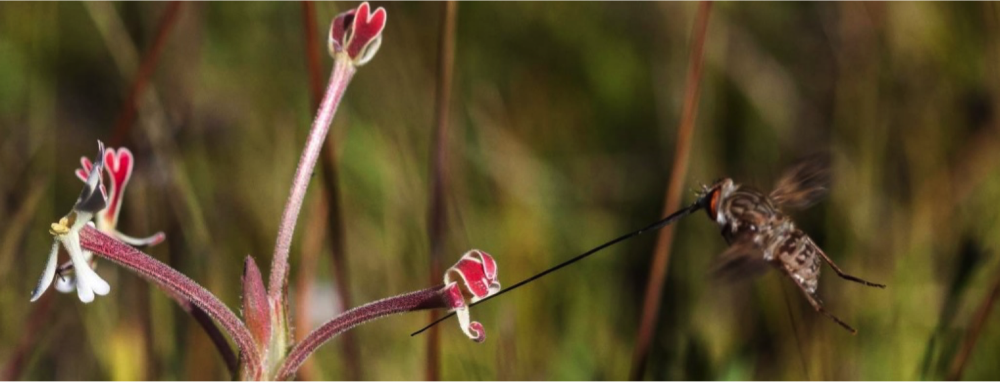
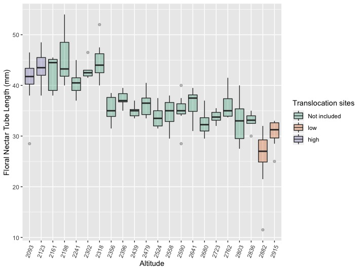
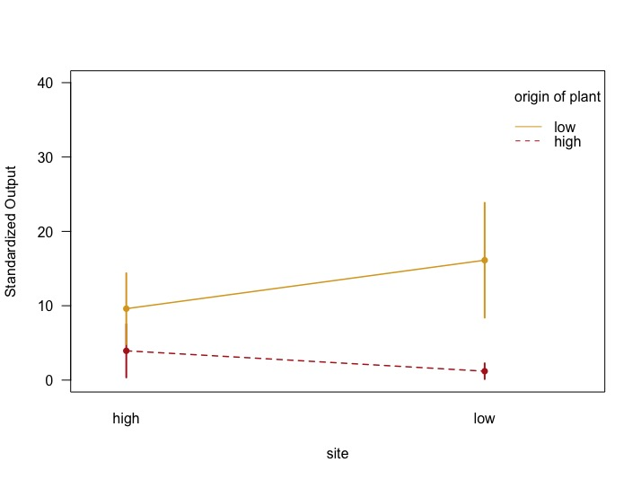

## Altitude as a driver  of diversification and local adaptation in a highly coevolved plant-pollinator pair 

### Louise Barton  |  12 April 2019
#### Masters Thesis Research: Louise K. Barton, Steven D. Johnson, Timo van der Niet, Ruth Cozien, Bruce Anderson, and Erin A. Tripp 

## Biological Questions
**Within *Z. microsiphon***

**[1]** Is there a continuous decrease in nectar tube length with   
increasing altitude?  
**[2]** Is trait variation across the landscape a result of adaptation to local pollinators?

## Introduction
Species that interact strongly often undergo reciprocal coadaptation and thus exhibit coevolutionary patterns. A long-standing aim of evolutionary ecology is to understand these patterns, and specifically to gain insight into the geographic selection mosaic underlying trait divergence among populations of interacting species.  Here we evaluate whether local adaptation could account for an altitudinal cline in the floral morphology of *Zaluzianskya microsiphon* (Scrophulariaceae).  Floral nectar tubes of this species have been shown to co-vary with proboscis length of its long-proboscid fly pollinator *Prosoeca ganglbaueri* (Nemestrinidae) over large geographical spatial scales, but the role of selection in explaining variation in floral tube length at smaller spatial scales had not been investigated.

## Methods
#### Data Collection
We examine the influence of altitude on ecotype variation in *Z. microsiphon* and utilize reciprocal translocations to assess local adaptation at high and low altitude sites. To determine if there is a consistent pattern across the Drakensberg of decline in floral tube and proboscis length with altitude, extensive measurements of floral tube length were taken along a 40m-altitudinal cline [2000-3200m: 22 populations], with the prediction that length of floral nectar tubes will continuously decrease with increasing altitude.  Reciprocal translocation experiments were established in a paired design at high [2880m] and low [2190m] altitude sites. Each pair consisted of two virgin inflorescences with equal flower counts, one from the local ecotype and one translocated. At high sites 28 pairs were established [HH + HL], and at low sites 30 pairs [LL + LH].  Flowers were collected after 7 days, and reproductive output calculated for each inflorescence as number of fruits produced x mean number of seeds per fruit. Assuming that trait variation across the landscape is a result of adaption to local pollinators, we expect that translocated plants [with mismatched traits] will exhibit reduced fecundity [reduced total seed output] compared to natives [with matched traits].

#### Analyses
Data was in two CSV files. The [first](DATA.xlsx) was from translocations and was comprised of 117 lines arranged in 23 columns, and was 72,081 bytes.  The [second](tubelength.csv) was from gradient sampling and was comprised of nectar tube measurements. It was 168 lines arranged in 5 columns, and was 4,213 bytes. Inconsistencies and spelling errors in the data were resolved in Rstudio [script](CompBio_proj2.R). Histograms were used to visualize the structure of the data, and summary plots made for both the altitudinal gradient and for reproductive output following translocations. A linear model was fit for tube lengths along the gradients, and checked by plotting against the residuals and with a qqnorm plot. I then made two scatterplots with confidence intervals, one with all data and one with means only. I repeated this using ggplot, and also made a box plot in ggplot to better visualize these data. The boxplot was color coded to show the plots that were also used in the translocation experiments. I then used a 2 way anova to visual the interaction between reproductive output and the translocation experiments. Total reproductive output for each inflorescence used in our reciprocal translocation experiments was estimated by multiplying the number of fruit produced by the mean number of seeds present in each fruit and then dividing by the number of flowers present on an inflorescence. 

## Results and Conclusions 
Through a linear regression, we found that 73.6% of the variation in nectar tube length can be predicted by altitude, and that floral nectar tube length significantly decreased with increases in altitude. [F=59.41, r2=0.73, p<<0.01].

There is an interaction between location of experiment (site) and origin of plant (ecotype) on reproductive output. Inflorescences at low sites producing significantly more seeds (fruit count x mean seed count per fruit) than those at high sites. Effect of nectar tube length on reproductive output was dependent on the site in which the inflorescence was placed, with ecotypes matched to their local environment exhibiting significantly greater output than those that were translocated. 

The results of this study confirm the existence of fine scale altitudinal clines in the lengths of floral tubes and proboscides of the interacting mutualists _Zaluzianskya microsiphon_ and _Prosoeca ganglbauri_. The results of the reciprocal translocation experiments suggest that plants are locally adapted along the altitudinal gradient and that selection is mediated via the fit between floral tubes and proboscis length in the local fly population.

## References 
My own data: in the form of two CSV files (see above for links)

