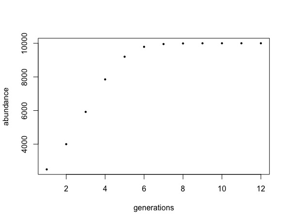

## Lab08: Documentation and Metadata
### Louise Barton | 8 March 2019

### Goals for this lab 
* practice creating metadata files for your work 
* practice using Markdown

### Source file
To view full R source file, click [HERE](BARTON_lab08.R). 

### Exercises: 

1. For loop which implements the discrete-time logistic growth model `n[t] = n[t-1] + ( r * n[t-1] * (K - n[t-1])/K )`. In this model,  `K` is carrying capacity, `r` is the intrinsic growth rate and `t` is representative of each time step.
 
	**Step 1**: Assign values for K, r,  `time` (number of time steps to iterate over), and `iAbund` (initial abundance). Create empty vector with initial abundance (`n`).  
	 ```
	K <- 10000 
	r <- 0.8  
	time <- 12 
	iAbund <- 2500 
	n <- rep(iAbund,time)
	```
	
	**Step 2**: Create for loop which generates vector of predicted population abundances

	```
	for (i in 2:time ) {
	        n[i] <- n[i-1] + ( r * n[i-1] * ( K - n[i-1] ) / K )
	        print(n[i])
	    }
	```

2. Function which utilizes for loop from _question one_ and takes `r, K, n, and iAbund` as arguments 

	**Step 1**: Specify function which outputs a vector and plot of population abundances over time 
	
	 ```
	 DTLogGrowth <- function (r,K,time,iAbund) {
	        n <- rep(iAbund, time)
	        for (i in 2:time ) {
	            n[i] <- n[i-1] + ( r * n[i-1] * ( K - n[i-1] ) / K )
	        }
	        plotGrowth <- plot(abundance ~ c(1:time), pch = 16, cex = .6,
	                           ylab = "abundance", xlab= "generations" )
	        print(plotGrowth)
	        return(n)
	    }
	```
	   
	**Step 2**: Implement function after defining `r, K, time, and iAbund`
	```
	r <- 0.8
	K <- 10000
	time <- 12 
	iAbund <- 2500
	abundance <- DTLogGrowth(r, K, time, iAbund)
	```
	
	**Example of Graph output using assignments tested above** 
	

	**Step 3**: create data frame with time and abundances  from example above and save as "[**PopAbund.csv**](PopAbund.csv)"

	```
	PopAbund <- data.frame((1:time), (abundance))
	colnames(PopAbund) <- c("Generations", "Abundance")
	write.csv(x = PopAbund, file = "PopAbund.csv")
	```
	


